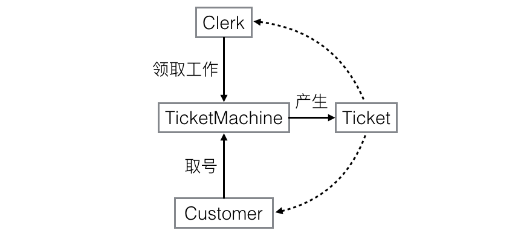
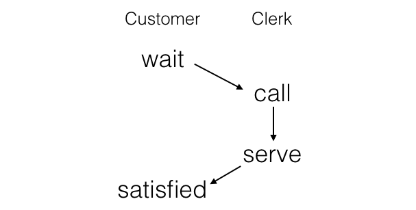
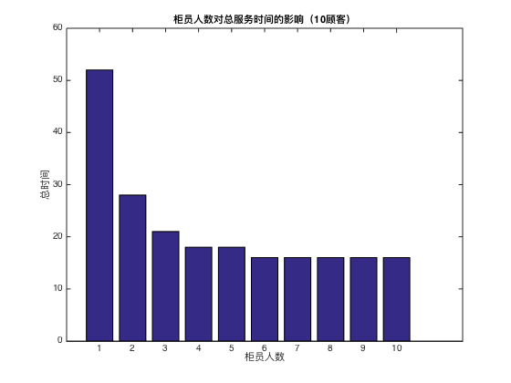

% 银行柜员服务问题
% 无36
  李思涵
  2013011187
  <lisihan969@gmail.com>
% \today

# 问题

银行有 n 个柜员负责为顾客服务，顾客进入银行先取一个号码，然后等着叫号。当某个柜员空闲下来，
就叫下一个号。

编程实现该问题，用P、V操作实现柜员和顾客的同步。

## 实现要求

1.	某个号码只能由一名顾客取得；
2.	不能有多于一个柜员叫同一个号；
3.	有顾客的时候，柜员才叫号；
4.	无柜员空闲的时候，顾客需要等待；
5.	无顾客的时候，柜员需要等待。

## 实现提示

1.	互斥对象：顾客拿号，柜员叫号；
2.	同步对象：顾客和柜员；
3.	等待同步对象的队列：等待的顾客，等待的柜员；
4.	所有数据结构在访问时也需要互斥。

## 测试文本格式

测试文件由若干记录组成，记录的字段用空格分开。记录第一个字段是顾客序号，第二字段为顾客进入
银行的时间，第三字段是顾客需要服务的时间。

下面是一个测试数据文件的例子：

    1 1 10
    2 5 2
    3 6 3

## 输出要求

对于每个顾客需输出进入银行的时间、开始服务的时间、离开银行的时间和服务柜员号。

## 实验报告内容要求

- 写出设计思路和程序结构，并对主要代码进行分析；
- 实际程序运行情况；
- 对提出的问题进行解答；
- 体会或者是遇到的问题。


# 模块设计

由于我们的目标是模拟用户与柜员的行为，将每个顾客和柜员实现成独立线程便是一个十分自然的想法。
然而，问题的关键在于如何同步二者。为此，我们抽象出“号”和“取号机”两个实体。顾客进入银行时，
通过取号机取号。同时，柜员空闲时，通过取号机领取要服务的号。这样，二者便通过“号”这个抽象概念
联系起来，并可以通过其实现后续的同步操作了。各个模块之间的关系如图所示。



Customer 和 Clerk 之间的同步则通过 Ticket 中的信号量实现，服务流程如图所示。



# 代码实现

我们使用 Python 3.5.0 来实现我们的代码。线程和信号量则是分别使用标准库 threading 模块中的
Thread 和 Semaphore。具体代码实现如下：

```python
import logging
from sys import argv, exit
from threading import Thread, Semaphore
from time import sleep, time

logging.basicConfig(level=logging.WARNING)
begin_time = None
print_lock = Semaphore()

class Ticket(object):
    """Bank ticket"""
    def __init__(self, number):
        self.number = number
        self.customer = Semaphore(0)
        self.clerk = Semaphore(0)
        self.clerk_name = None

    def __str__(self):
        return str(self.number)

    def wait(self):
        self.customer.release()
        self.clerk.acquire()
        return self.clerk_name

    def call(self, clerk_name):
        self.customer.acquire()
        self.clerk_name = clerk_name
        self.clerk.release()

    def satisfied(self):
        self.customer.release()

    def serve(self):
        self.customer.acquire()

class TicketMachine(object):
    """Bank ticket machine"""
    def __init__(self, max_tickets=float('inf')):
        self.next_customer_number = 0
        self.next_clerk_number = 0
        self.tickets = []
        self.max_tickets = max_tickets

        self.available = Semaphore()

    def customer_get_ticket(self):
        self.available.acquire()

        if self.next_customer_number >= self.max_tickets:
            ticket = None  # No more tickets.
        elif self.next_customer_number >= self.next_clerk_number:
            # We need a new ticket.
            ticket = Ticket(self.next_customer_number)
            self.tickets.append(ticket)
        else:
            # The ticket already exists.
            ticket = self.tickets[self.next_customer_number]
        self.next_customer_number += 1

        self.available.release()  # Make self available.
        return ticket

    def clerk_get_ticket(self):
        self.available.acquire()

        if self.next_clerk_number >= self.max_tickets:
            ticket = None  # No more tickets.
        elif self.next_clerk_number >= self.next_customer_number:
            # We need a new ticket.
            ticket = Ticket(self.next_clerk_number)
            self.tickets.append(ticket)
        else:
            # The ticket already exists.
            ticket = self.tickets[self.next_clerk_number]
        self.next_clerk_number += 1

        self.available.release()  # Make self available.
        return ticket

class Customer(Thread):
    """Bank customer"""
    def __init__(self, name, arrive_time, serve_time, ticket_machine):
        super().__init__(name=name)
        self.arrive_time = arrive_time
        self.serve_time = serve_time
        self.ticket_machine = ticket_machine

        self.logger = logging.getLogger('Customer ' + name)

    def run(self):
        global begin_time

        sleep(self.arrive_time)
        arrive_time = time() - begin_time

        self.logger.info('Arrived, trying to get a ticket.')
        ticket = self.ticket_machine.customer_get_ticket()
        self.logger.info('Got ticket %s.', ticket)

        clerk_name = ticket.wait()

        self.logger.info('Begin to be served by Clerk %s.', clerk_name)
        serve_begin_time = time() - begin_time
        sleep(self.serve_time)

        self.logger.info('Satisfied.')
        ticket.satisfied()
        leave_time = time() - begin_time

        # Print result:
        result = '{} {:.1f} {:.1f} {:.1f} {}'.format(self.name,
                                                     arrive_time,
                                                     serve_begin_time,
                                                     leave_time,
                                                     clerk_name)
        print_lock.acquire()
        print(result)
        print_lock.release()


class Clerk(Thread):
    """Bank clerk"""
    def __init__(self, name, ticket_machine):
        super().__init__(name=name)
        self.ticket_machine = ticket_machine
        self.logger = logging.getLogger('Clerk ' + name)

    def run(self):
        while True:
            ticket = self.ticket_machine.clerk_get_ticket()
            if ticket is None:
                self.logger.info('No more customers, stop working.')
                return

            self.logger.info('Free now, assigned to ticket %s.', ticket)

            ticket.call(self.name)
            self.logger.info('Calling ticket %s.', ticket)

            self.logger.info('Serving ticket %s.', ticket)
            ticket.serve()
            self.logger.info('Done ticket %s.', ticket)

def load_customers(filename, ticket_machine):
    customers = []
    for line in open(filename):
        name, arrive_time, serve_time = line.split()
        arrive_time = float(arrive_time)
        serve_time = float(serve_time)
        customers.append(Customer(name, arrive_time, serve_time, ticket_machine))

    ticket_machine.max_tickets = len(customers)
    return customers

def load_clerks(number, ticket_machine):
    clerks = []
    for i in range(number):
        clerks.append(Clerk(str(i), ticket_machine))
    return clerks

def run(customers, clerks):
    # Record begin time.
    global begin_time
    begin_time = time()

    for customer in customers:
        customer.start()
    for clerk in clerks:
        clerk.start()

if __name__ == '__main__':
    if len(argv) != 3:
        print('Usage:', argv[0], '<input file> <clerk number>')
        exit(1)

    ticket_machine = TicketMachine()
    customers = load_customers(argv[1], ticket_machine)
    clerks = load_clerks(int(argv[2]), ticket_machine)

    run(customers, clerks)
```

可以看到，程序的关键部分是 `Ticket` 类中如下四个函数：

```python
def wait(self):
    self.customer.release()
    self.clerk.acquire()
    return self.clerk_name

def call(self, clerk_name):
    self.customer.acquire()
    self.clerk_name = clerk_name
    self.clerk.release()

def satisfied(self):
    self.customer.release()

def serve(self):
    self.customer.acquire()
```

其中，`wait`, `satisfied` 由 `Customer` 调用，`call`, `serve` 由 `Clerk` 调用。这
四个函数包含了两个方向的 PV 对，从而实现了 `Customer` 与 `Clerk` 的同步。

# 实验结果

我们使用题目中所给的样例输入，使用两个柜员，得到的结果如下：

```bash
$ python3 main.py input.txt 2
2 5.0 5.0 7.0 1
3 6.0 7.0 10.0 1
1 1.0 1.0 11.0 0
```

可以看到，顾客 1 首先被柜员 0 服务，紧接着顾客 2 开始被柜员 1 服务。这时顾客 3 进入了银行，
开始等待。然后柜员 1 服务完了顾客 2，开始服务顾客 3。最后两柜员先后完成了服务。我们尝试一个
更复杂的例子：

```
1  1  10
2  5  2
3  6  3
4  6  5
5  3  8
6  7  1
7  10 5
8  9  7
9  2  8
10 8  2
```

程序输出如下：

```bash
$ python3 main.py input2.txt 4
2 5.0 5.0 7.0 3
9 2.0 2.0 10.0 1
3 6.0 7.0 10.0 3
5 3.0 3.0 11.0 2
1 1.0 1.0 11.0 0
6 7.0 10.0 11.0 3
10 8.0 11.0 13.0 2
4 6.0 10.0 15.0 1
7 10.0 11.0 16.0 3
8 9.0 11.0 18.0 0
```

这说明我们的代码确实正确实现了题目中要求的功能。

# 思考题

##	柜员人数和顾客人数对结果分别有什么影响？

当柜员人数不变，顾客所需的等待时间满足相同的分布的时候，总等待时间的期望会随着人数的增多而线性
增长。

当顾客不变，而柜员人数增长时，总等待时间首先会减小，同时减小的速度越来越慢，并且最后会到达一个
最小值。这是因为，当柜员人数达到一定时，每个顾客都不需要排队了，故继续增加柜员人数没有意义。
其变化关系如图所示。



##	实现互斥的方法有哪些？各自有什么特点？效率如何？

实现互斥可以用以下方法：

- 禁止中断：简单，但把禁止中断的权利交给用户进程导致系统可靠性较差，不适用于多处理器。
- 自旋锁：忙等待，浪费 CPU 时间，只有等待时间非常短的情况下才比较适用。
- 严格轮转法：要求两个进程严格轮流进入临界区，忙等待。
- Peterson 算法：可以正常地工作，忙等待。
- 硬件指令方法：适用于任意数目的进程，简单，可以支持进程中存在多个临界区，忙等待。
- 信号量：控制分布在整个程序中，正确性分析很困难
- 管程：是一个编程语言概念，编译器必须要识别管程并用某种方式对其互斥做出安排。
- 消息传递：适用于不同机器间的通信。

其中，包含忙等待的方法都有可能造成优先级反转，也就是高优先级的进程反而分配不到计算资源的情况。
禁止中断，硬件指令，信号量等方式效率很高。消息传递的效率较低，更适合用于不同机器之间通信。

# 实验感想

这次实验中，我通过多线程的方式模拟了银行的排队叫号系统。与以往的实现不同的是，我在这次实验中
采用了对象化的思想，也就是将问题中的每一个实体抽象化成一个对象，将实体之间的交互转化为对象之间
的调用，从而使得程序比较形象化。我觉得这也是面向对象编程的一个优势：它在一定程度上便是对现实世界
的一个描述，所以很容易理解。
